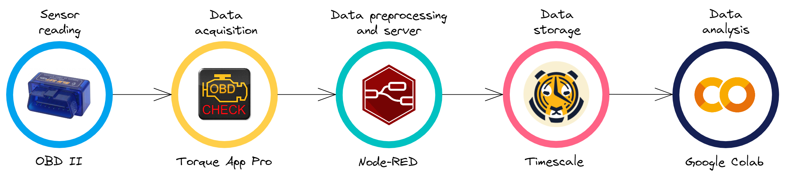

## Introduction

Modern vehicles have a variety of sensors that constantly generate a vast amount of information. During a car trip, for example, these sensors can collect data about the travel time, the speeds reached during the trip, the emission of gases into the atmosphere, and many other important information.

Using a device called On-Board Diagnostics II (OBD-II), it is possible to read the values from these sensors and perform a comprehensive analysis of the collected data. In this way, this project aims to create a server that establishes a data flow, allowing the capture, sending, processing, and storage of this data in a time-series database. This information can later be used by data scientists to solve problems and perform advanced analysis.

## The big picture

To create an efficient data flow that allows the analysis of the information coming from a vehicle, several tools were used, each one responsible for a specific step of the process.

First, to perform the **sensor reading**, the **OBD-II** device was used, which is connected to a specific location on the vehicle and is responsible for collecting the sensor values. Then, the **Torque App Pro** application, available on Android smartphones, is connected via bluetooth to the OBD-II to **capture the data** provided by it. This app allows the selection of which sensors will be measured during a trip, allowing the creation of a customized vehicle profile.

After this step, the captured data is sent to a server created with the **Node-Red** tool, which performs the **pre-processing** of the data to leave it in a standard format for. This step is followed by the **data storage** in the **Timescale** database, a Postgres-based database with specific features for time series storage.

Finally, for the **data analysis** step, the **Google Colaboratory** is used, a tool that allows the application of data science algorithms to analyze the information captured by the OBD-II, such as average travel time, speed and route taken by the driver. With these tools together, it is possible to create a complete data stream and perform advanced analysis.



## How to run

### Requirements

- You have an OBD-II device to plug into a car to run the codes from this repository. It can be found cheaply at [Amazon](https://www.amazon.com.br/), for example.
- You have the Torque App Pro on an Android smartphone. The app can be downloaded from the Play Store [here](https://play.google.com/store/apps/details?id=org.prowl.torque&hl=pt_BR&gl=US).
- You have docker installed on your machine. You can install it [here](https://www.docker.com/).

### Part I) Starting Node-RED server

1- Clone this repository 

```
git clone https://github.com/conect2ai/vehicle2nodered.git
```

2- Install Node-RED tool in your machine

You can follow the steps of how to do it [here](https://nodered.org/docs/getting-started/docker)

3- Access Node-RED server locally

After creating an container for Node-RED in docker, access the address `http://127.0.0.1:1880/` in your browser.

4- Install libraries

In the menu located in the upper right corner, click in the option `Manage pallete`, select the option `Install` and install the following libraries:

- `node-red-contrib-moment`
- `node-red-contrib-re-postgres`

5- Import the Node-RED flow

In the option `Import`, choose the option `select a file to import` and select the file `flows.json` that is in this repository. Press the button `Deploy` to save the changes, and the server is ready to work!

### Part II) Configure Torque App Pro

1- Connect the OBD-II to the app

When you access the app, select the gear in the lower left corner, then `Settings` >> `OB2 Adapter Settings` >> `Choose Bluetooth Device`. You need to inform to the app which is your bluetooth device. 

2- Configure the data upload to the web server

In the option `Settings` >> `Data Logging & Upload`, do the following steps:

- In the option `Select what to log`, choose the sensors you want to read from your car
- In the option `File Logging Interval`, choose the option 1 second
- In the option `Web Logging Interval`, choose the option Every minute or a higher number
- In the option `Webserver URL`, put `http://<your-ip>:1880/upload` 

:heavy_exclamation_mark: Attention! Make sure your smartphone and your machine with the server are connected at the same network.

- In the option `User email address`, put your e-mail

After that, if the OBD-II is rightly connected to Torque App Pro, you should start receiving messages at the Node-RED server with the values of each measure made by the sensors of your car. 

### Part III) Configure your service on Timescale

1- Create an account on [Timescale](https://www.timescale.com/)

2- On the `Services` page, choose the option `Create service` and create the service to store your data. Wait until the deployment is complete.

3- Afterward, go to `Connection Info` and retrieve the following information: database name, host, port, username, and password.

4- Access the server in Node-RED, and in the node labeled `Connection Timescale`, click on the pencil icon and update the information with your database connection details. 

5- Go back to your server in Node-RED and press the button beside the node labeled `SQL create table` (to create the table to store data in Timescale), and then, press the button beside the node labeled `SQL create hypertable` (to create a hypertable in Timescale).

### Part IV) Analyse your data


